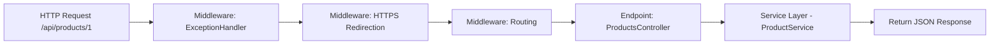

# SimplePipelineDemo  
A clean, beginner-friendly demonstration of how an ASP.NET Core Web API request travels through the **middleware pipeline** — from the moment a GET request arrives until JSON is returned.

This project includes:
- ✔ Simple `/api/products/{id}` endpoint  
- ✔ Custom service layer (`IProductService`)  
- ✔ The full ASP.NET Core request pipeline  
- ✔ Docker support (Dockerfile included)  
- ✔ GitHub Actions CI workflow  
- ✔ Diagram explaining the request flow  

---

## 📌 Project Purpose
Use this project to demonstrate your understanding of:
- How the ASP.NET Core middleware pipeline works  
- Routing, controllers, and model binding  
- Dependency injection  
- Service layers  
- JSON serialization  
- Dockerized Web APIs  
- GitHub Actions CI pipelines  

---

## 📁 Project Structure

```
SimplePipelineDemo/
├── Controllers/
│ └── ProductsController.cs
├── Services/
│ ├── IProductService.cs
│ └── ProductService.cs
├── Models/
│ └── Product.cs
├── Program.cs
├── Dockerfile
├── README.md
└── .github/workflows/ci.yml
```

---

# 🚀 1. Create the Project (Visual Studio 2022)

1. Open **Visual Studio 2022**  
2. Click **Create a new project**  
3. Search: **API** → select **ASP.NET Core Web API** → Next  
4. Configure:
   - **Project name:** `SimplePipelineDemo`
   - **Framework:** `.NET 8.0`
   - **Use Controllers:** ✔ Enabled  
   - **OpenAPI/Swagger:** ✔ Enabled  
5. Click **Create**

---

# 📂 2. Create Folders & Files

### Create folders
In **Solution Explorer**:

- Right-click the project → **Add → New Folder** → `Models`
- Add another folder → `Services`

### Remove sample template file (optional)
- Delete `WeatherForecastController.cs`

### Create the files below:

- `Models/Product.cs`
- `Services/IProductService.cs`
- `Services/ProductService.cs`
- `Controllers/ProductsController.cs`


# 🧩 3. Paste the Code (Complete Source Files)

## 📌 **Models/Product.cs**
```csharp
public class Product
{
    public int Id { get; set; }
    public string Name { get; set; } = string.Empty;
}

```

## 📌 **Services/IProductService.cs**

```csharp
public interface IProductService
{
    Product? GetProduct(int id);
}

```

## 📌 **Services/ProductService.cs**

```csharp
using System.Collections.Generic;
using System.Linq;

public class ProductService : IProductService
{
    private static readonly List<Product> _products = new()
    {
        new Product { Id = 121, Name = "Laptop" },
        new Product { Id = 122, Name = "Phone" },
        new Product { Id = 123, Name = "Headphones" }
    };

    public Product? GetProduct(int id)
    {
        return _products.FirstOrDefault(p => p.Id == id);
    }
}

```
## 📌 **Controllers/Prod**

```csharp
using Microsoft.AspNetCore.Mvc;

[ApiController]
[Route("api/[controller]")]
public class ProductsController : ControllerBase
{
    private readonly IProductService _service;

    public ProductsController(IProductService service)
    {
        _service = service;
    }

    // GET api/products/1
    [HttpGet("{id}")]
    public IActionResult GetProduct(int id)
    {
        var product = _service.GetProduct(id);
        if (product == null)
            return NotFound(new { message = "Product not found." });

        return Ok(product); // returned as JSON
    }
}


```
## 📌 **Program.cs**

```csharp
var builder = WebApplication.CreateBuilder(args);

// Register services
builder.Services.AddControllers();
builder.Services.AddSingleton<IProductService, ProductService>();

var app = builder.Build();

// Simple middleware order showing pipeline
app.UseExceptionHandler("/error");   // 1 - global error handler
app.UseHttpsRedirection();          // 2 - redirect to HTTPS (optional)
app.UseRouting();                   // 3 - route matching
// (Authentication/Authorization could go here)
app.MapControllers();               // 4 - endpoint execution

app.Run();

```
# ▶️ 4. Run the App (Visual Studio)

1. Click Run ▶ (choose the project, not IIS Express)
2. Swagger UI will open automatically:

**Swagger open at:**
```bash
https://localhost:{PORT}/swagger
```
**Test:**
```bash
GET /api/products/123

```
**You should see:**
```bash
{
  "id": 1,
  "name": "Headphones"
}

```
# 🐳 5. Run Using Docker
## 📌 **Dockerfile**
```dockerfile
# Build stage
FROM mcr.microsoft.com/dotnet/sdk:8.0 AS build
WORKDIR /src

COPY . .
RUN dotnet restore
RUN dotnet publish -c Release -o /app

# Runtime stage
FROM mcr.microsoft.com/dotnet/aspnet:8.0
WORKDIR /app
COPY --from=build /app .

ENTRYPOINT ["dotnet", "SimplePipelineDemo.dll"]

```
## 📌 **Build & Run**
## **Build image**
```bash
docker build -t simplepipeline-demo .

```

## **Run container**
```bash
docker run -p 8080:8080 simplepipeline-demo

```

## **API now accessible at:**
```bash
http://localhost:8080/api/products/123
```
# ⚙️ 6. GitHub Actions CI
##  **Create folder:**
```bash
.github/workflows/ci.yml

```
## **Paste:**
```yaml
name: Build .NET API

on:
  push:
    branches: [ "main" ]
  pull_request:
    branches: [ "main" ]

jobs:
  build:
    runs-on: ubuntu-latest

    steps:
    - uses: actions/checkout@v3

    - name: Setup .NET
      uses: actions/setup-dotnet@v3
      with:
        dotnet-version: 8.0.x

    - name: Restore dependencies
      run: dotnet restore

    - name: Build
      run: dotnet build --configuration Release --no-restore

    - name: Publish
      run: dotnet publish --configuration Release --no-restore --output build

```
# 🧠 7. How the Pipeline Works

```
flowchart LR

A[HTTP Request /api/products/1] --> B[Middleware: ExceptionHandler]
B --> C[Middleware: HTTPS Redirection]
C --> D[Middleware: Routing]
D --> E[Endpoint: ProductsController]
E --> F[Service Layer - ProductService]
F --> G[Return JSON Response]


```

# 📝 8. High-Level Explanation

```
A request enters ASP.NET Core and passes through several middleware components.
Each component can modify the request or response.
```
1. **ExceptionHandler** catches errors  
2. **HTTPS Redirection** forces secure traffic
3. **Routing** matches /api/products/1
4. **Endpoint** executes ProductsController.GetProduct()
5. Controller uses **IProductService**
6. Returned model is serialized into JSON
7. Routing matches /api/products/1

This project demonstrates that entire lifecycle clearly and simply.
```


```
